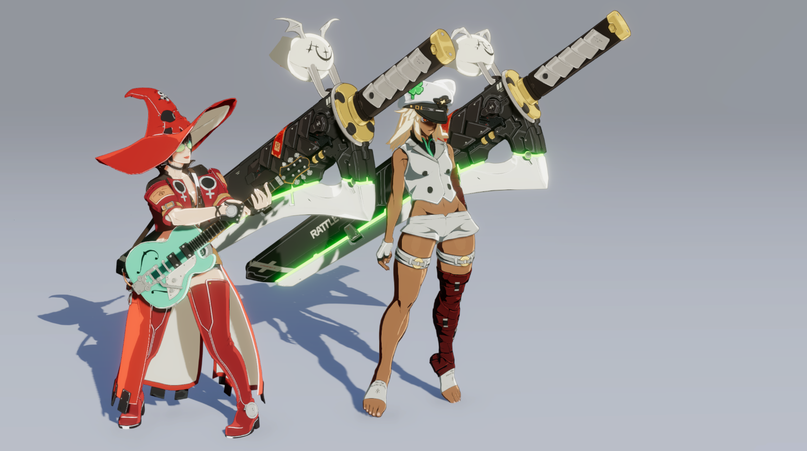

## 最终效果
整体渲染比较简单，美术为主


## 贴图分析

- BaseMap：基础色；
- ShadowMap：暗部衰减色，与BaseMap相乘构成暗部；
- DetailMap：磨损线条；
- ilm.r：高光类型；
> 如何区分高光类型？
> > [0,10] 普通 无边缘光    
> > (10,145]皮革 皮肤 有边缘光 
> > (145,200] 头发 有边缘光
> > (200,255] 金属 裁剪高光 无边缘光
> ```hlsl
> // 线性空间的伽马矫正 后转为
> pow(ilm.r,1/2.2)  *　255　
> //皮革边缘处 大腿皮肤 裁边高光  
if(Layer >= 10 && Layer<= 145)
{...}  
if(Layer > 145  && Layer<= 200)
{...}  
if(Layer > 200) 
{...}
> ```

- ilm.g：Ramp偏移值；
> 没啥好说的，直接在NoL Step前叠加
- ilm.b：高光强度Mask；
 >通过和ilm.r一样的算法，把单通道提取出不同区域的Mask，用于高光的Mask
- ilm.a：内描边Mask；
- VertexColor.r：AO部分；
- VertexColor.g：用于区分身体各个部位；
- VertexColor.b：描边粗细；


## 渲染效果实现
### Diffuse
伪代码
```hlsl
LightThreshold = Step( CtrlValue , (NoL_half + Offset) * AO ) *　SelfShadow
Base = BaseCol.rgb * InnerLine ( ilm.a 也就是内描边图) * Detail （额外的Detail图）
Shadow = SSSCol.rgb * BaseCol.rgb;
Diffuse = lerp( Shadow , Base , LightThreshold ) * mainLight.color;
```
### Specular
伪代码
```hlsl
if( Layer >= 10 && Layer<= 140) // 皮革皮肤 Step高光
{  
    Specular = lerp(Specular, BodySpecular , BodyStepSpecularMask);  
}  
  
if(Layer > 145  && Layer<= 200) // 头发区域 Step高光
{  
    Specular = lerp(Specular, HairSpecular , HairStepSpecularMask);  
}  
if(Layer> 200) //金属部分 Bliinnphong
{  
    Specular += MetallicStepSpecular;
}
```
### Rim
伪代码
```hlsl
Rim = step(1 - _RimWidth,(1 - NoV)) * _RimIntensity * Base;  
Rim = lerp(0,Rim, LightThreshold);  
Rim = max(0, Rim);
```
### Outline

使用自己编写的通用Outline

----
**END**