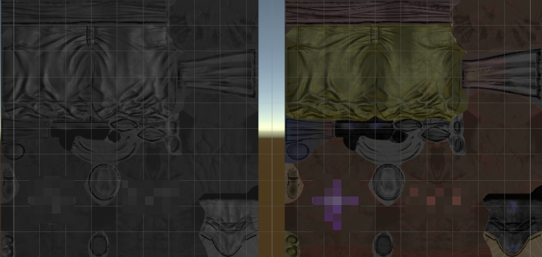

## 效果介绍

SpecularTint，即高光染色，给美术设计师让步而设计的朝Albedo的入射高光颜色

## 效果对比

Blender 中功能


## 效果制作

### Blender源码

```hlsl
float m_cdlum = luminance(BaseColor);
color m_ctint = m_cdlum > 0.0 ? BaseColor / m_cdlum : color(0.0, 0.0, 0.0);  
color tmp_col = color(1.0, 1.0, 1.0) * (1.0 - SpecularTint) + m_ctint * SpecularTint;
color Cspec0 = (Specular * 0.08 * tmp_col) * (1.0 - Metallic) + BaseColor * Metallic;
```

### Shader

```hlsl
InitializeBRDFData()

half m_cdlum = dot(Albedo, float3(0.2126729, 0.7151522, 0.0721750));  
half3 m_ctint = m_cdlum > 0.0h ? Albedo / max(m_cdlum, 0.01h) : 0.0h;  
half3 tmp_col = (1.0h - SpecularTint) + m_ctint * SpecularTint;  
brdf.specular = lerp(kDieletricSpec.rgb * tmp_col, Albedo, Metallic);
```



